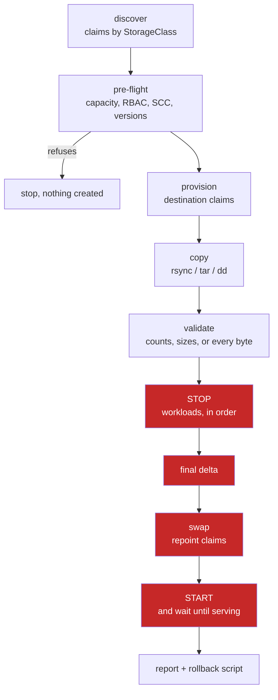
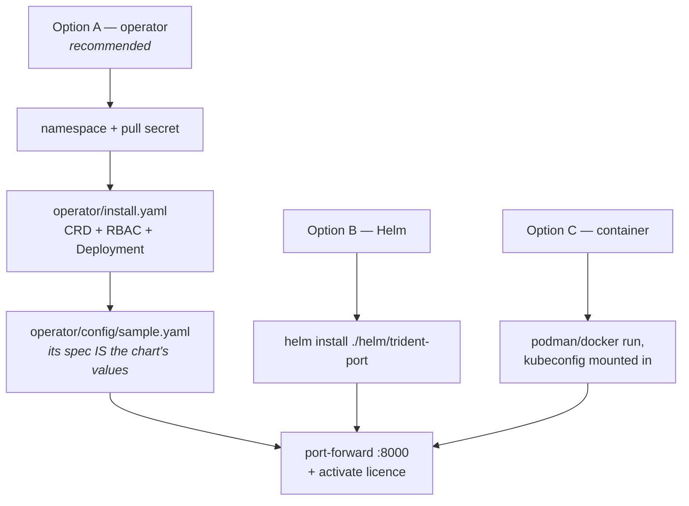
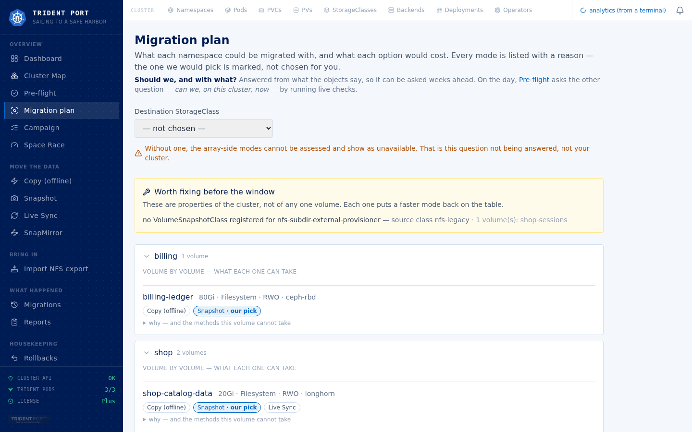
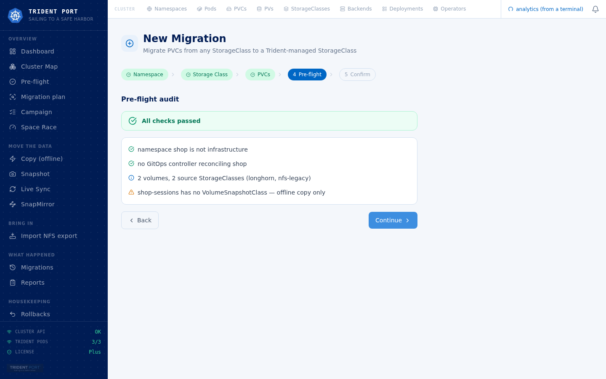

# Trident Port™

> **Sailing to a Safe Harbor** — move Kubernetes persistent volumes from any storage
> provisioner onto NetApp Trident CSI.

---

## What it is

Trident Port moves the data behind a `PersistentVolumeClaim` onto a
Trident-provisioned volume, then repoints the application at it — stopping what
holds the claim, in the right order, and putting it back.

**Source:** any provisioner — NFS subdir, Longhorn, Rook/Ceph (RBD and CephFS),
local-path, OpenEBS, vSphere CSI, Portworx, hand-made PVs, and Trident itself.

**Destination:** any Trident backend — `ontap-nas`, `ontap-nas-economy`,
`ontap-nas-flexgroup`, `ontap-san`, `ontap-san-economy`, `azure-netapp-files`,
FSx for ONTAP.

### There is always an outage

**This is not a live migration.** Pods restart to bind the new volume. What varies
between methods is *how much of the work happens before the outage starts*:

| Method | The application, from start to finish |
|---|---|
| **Offline copy** | `████████████████████████` |
| **Snapshot** | `░░░░░░░░░░░░░░░░░░░░░░░█` |
| **Live sync** | `█░░░░░░░░░░░░░░░░░░░░░░█` |
| **SnapMirror** | `░░░░░░░░░░░░░░░░░░░░░░░█` |

`░` the application is up and serving · `█` it is down

**Offline copy *is* the outage** — the row is black from the first byte to the last.
The other three move the copy in front of it and pay a prerequisite for the
privilege. **Live sync has a second black square, at the beginning**: its `start`
replaces every pod once to inject the sidecar, so the restart is paid up front and
only the final delta is new.

---

## The four methods

| Method | Application stopped for | Touches the array | Needs |
|---|---|---|---|
| **Offline copy** (`copy`) | the whole copy | no | nothing beyond a destination claim |
| **Snapshot** (`snapshot`) | the final delta only | no | a `VolumeSnapshotClass` whose driver matches the source provisioner, and a filesystem volume |
| **Live sync** (`live-sync`) | the sidecar restart at `start`, then the final cut | no, but a continuous read on the source | Kubernetes 1.29+, a filesystem volume, and room to inject a sidecar |
| **SnapMirror** (`snapmirror`) | the break and the mount | yes: the transfer competes with production I/O on the same aggregates | ONTAP at both ends, cluster peering, credentials on both |

`tp import` adopts an existing NFS export into a Trident claim without copying it —
the source is mounted read-only and never stopped.

The planner shows every method: the ones available here, ranked, and the ones that
are not, with the reason — *"snapshot is out because your CSI driver registers no
VolumeSnapshotClass"*.

**Constraints worth knowing before choosing:**

- **SnapMirror covers the economy case** (`ontap-nas-economy`, `ontap-san-economy`),
  which TMR and Trident Protect both exclude. Needs Trident **26.06+** (Tech
  Preview); pre-flight checks the version rather than failing at cutover.
- **SnapMirror's unit is the FlexVol, not the claim.** On `ontap-*-economy` several
  namespaces can share one FlexVol, and the array does its delta, break and resize
  **once per FlexVol**. `--plan-only` names who shares a FlexVol.
- **Three shapes handle that sharing differently:**
  - **`together`** cuts the whole FlexVol in one call. Every namespace sharing it
    must be named — `--with-flexvol-neighbours` folds a neighbour in — or only the
    first to reach the array wins the cut: the rest fail and the relationship is
    left broken, needing the baseline redone (measured on `lod3`: `1 cut over,
    2 failed`).
  - **`waves`** cuts one namespace per window, but fragments the estate
    permanently — a qtree cannot move between FlexVols, so each wave re-copies the
    FlexVol in full.
  - **`clonedWaves`** avoids both failure modes: one baseline transfer, then each
    wave cuts over its own FlexClone, so one namespace's failure never breaks the
    shared relationship or costs a re-copy. It still ends in N FlexVols, like
    `waves` — it saves transfers and source risk, not destination space.

- **Live sync's `start` costs a restart too** — the sidecar replaces every pod once
  before the sync begins. Only the final cutover delta is new.
- **A build can ship fewer methods.** *"Not included in this build"* is a different
  statement from *"your cluster cannot do this"*. Offline copy is never excluded.

---

## What a run does



**The four red boxes are the outage.** Everything before them runs with the
application up, whatever the method. Every phase writes its own duration into a
permanent trace; the reports read that back rather than asserting it.

**Source volumes are never deleted.** They are flipped to `Retain` before anything
is touched, so they outlive their claims. Leftovers are listed to reclaim; nothing
is deleted on your behalf.

---

## Requirements

| | |
|---|---|
| Kubernetes | whatever Trident supports · **1.29+** for live sync (native sidecars) |
| NetApp Trident | 24+ · **26.06+** for qtree import in SnapMirror mode |
| Trident backend | at least one `TridentBackendConfig` bound, provisioning into the destination StorageClass |
| Credentials | a Kubernetes Secret with the ONTAP credentials |
| Registry | the image is private — a `docker-registry` pull secret per namespace |
| Licence | a token bound to the cluster's `kube-system` namespace UID |

---

## Install



### Option A — the operator (recommended)

[`operator/README.md`](operator/README.md) is the runbook kept current, including
recovery from a stuck adoption. **Order matters: the operator always goes first** —
the chart compares a content digest of the RBAC it needs against what the
operator's `ClusterRole` actually holds, refuses to install on a mismatch rather
than upgrading halfway, and names the file to apply.

```bash
# 0. The operator's namespace and pull secret.
kubectl create namespace trident-port-system --save-config
kubectl -n trident-port-system create secret docker-registry ghcr \
  --docker-server=ghcr.io --docker-username=<user> --docker-password=<PAT>

# 1. The operator (CRD + RBAC + Deployment).
kubectl apply -f operator/install.yaml
kubectl -n trident-port-system rollout status deploy/trident-port-operator --timeout=300s

# 2. The product's namespace and its own pull secret — separate from the
#    operator's. The CR's spec IS the chart's values file.
kubectl create namespace trident-port
kubectl -n trident-port create secret docker-registry ghcr \
  --docker-server=ghcr.io --docker-username=<user> --docker-password=<PAT>
kubectl apply -f operator/config/sample.yaml
kubectl -n trident-port rollout status deploy/trident-port --timeout=300s
```

The operator writes the port-forward command and where the licence goes into the
`Deployed` condition:

```bash
kubectl -n trident-port get tridentport trident-port \
  -o jsonpath='{.status.conditions[?(@.type=="Deployed")].message}'
```

### Option B — Helm directly

```bash
helm install trident-port ./helm/trident-port \
  --namespace trident-port --create-namespace \
  --set image.pullSecrets[0]=ghcr \
  --values my-values.yaml
```

`image.tag` is empty on purpose — the chart installs its own `appVersion`, one
decision rather than two. Values, RBAC and exposure:
[`docs/INSTALL.md`](docs/INSTALL.md).

### Option C — a standalone container

The same image with a kubeconfig mounted in, running as `trident-port` (uid 1000),
not root. Steps in [`docs/INSTALL.md`](docs/INSTALL.md).

### Reaching the interface

The default Service is `ClusterIP`, and that is a decision: the API runs with the
deployment's RBAC, so anything that reaches it can stop workloads, swap PVs and
delete claims through it. Helm and the standalone container each generate and
persist a token on their own — a `X-Trident-Port-Token` header, checked in
constant time, required on every request except health, static assets and the
activation screen. Expose the port only on a trusted network anyway.

```bash
kubectl -n trident-port port-forward svc/trident-port 8000:8000
# http://localhost:8000 — the REST interface documents itself at /docs
```

### The licence

A licence is required to move data, bound to the cluster's `kube-system` UID.
Contact us to obtain one.

---

## Commands

Everything that **moves or swaps data** needs a licence. Everything that reads,
plans or undoes does not — refusing a rollback because a licence lapsed would hold
data hostage, and refusing to answer *"what would this cost"* is refusing to sell.

**Reading and planning — no licence**

| Command | What it does |
|---|---|
| `tp survey` | can this cluster be migrated from? Read-only; dry-runs a copy pod's admission |
| `tp plan` | what would happen to one namespace's claims, method by method |
| `tp space` | will the source volume fill before the baseline finishes? Sampled over time |
| `tp validate` | compare source and destination; moves nothing |
| `tp sessions` | list the migrations on this installation, or follow one |
| `tp report` | what happened to a namespace's volumes, as the interface shows it |
| `tp array-leftovers` | volumes on an array that nothing in this cluster names any more — lists and explains, deletes nothing |
| `tp pre-engagement` | hand over the read-mostly assessment kit for a first customer conversation |
| `tp rollback` | restore reclaim policies, list or remove leftovers |
| `tp start` | bring the applications back — what somebody needs when a run stopped |
| `tp support-bundle` | collect everything that happened |
| `tp stand-down` | take this deployment to zero if the licence lapsed |

**Moving data — licensed**

| Command | What it does |
|---|---|
| `tp auto` | a whole namespace, stopped once: discover, pre-flight, copy, validate, cut over, verify |
| `tp migrate` | one volume |
| `tp batch` | several namespaces in turn, each with its own destination |
| `tp snapshot` | copy the clone with the applications running (`bulk`), then swap (`cutover`) |
| `tp live-sync` | `start`, `status`, `stop`, `cutover` |
| `tp snapmirror` | replicate FlexVols between arrays and adopt what is inside them |
| `tp import` | bring a foreign NFS export into a Trident claim |
| `tp cutover` | point the claims at the new volumes |
| `tp stop` | stop what holds the claims |

### A namespace, end to end

```bash
# Rehearse: discovery and pre-flight only. Nothing created, stopped or copied.
tp auto --namespace shop --dest-sc ontap-nas --dry-run

# Do it. One stop, every claim in the namespace.
tp auto --namespace shop --dest-sc ontap-nas

# Several source classes in one namespace: a destination per source class.
tp auto --namespace shop --dest-sc ontap-nas --sc-map "longhorn=ontap-nas,ceph-rbd=ontap-san"

# Copy and validate, leave the applications where they are.
tp auto --namespace shop --dest-sc ontap-nas --exclude cache-0 --no-cutover
```

**Four knobs decide most of the window**, all defaulting to *all at once* except
adoption:

| Flag | What it parallelises | Default |
|---|---|---|
| `--copy-parallel` | the copy — a Job, a pod and an image pull per volume | all |
| `--stop-parallel` | stopping workloads, within each ordering tier | all |
| `--start-parallel` | bringing them back — applications are already down, so raising it interrupts nothing live | all |
| `--adopt-parallel` | `tridentctl import` | **1** — concurrency here has not been measured |

`--bwlimit` caps the read rate the way rsync takes it (`20M`, `200K`) and is the
only throttle that does anything.

### The other methods

```bash
# Snapshot: copy from a clone with the application up, then take the delta.
tp snapshot bulk    --namespace shop --pvc data-0 data-1 --dest-sc ontap-nas
tp snapshot cutover --namespace shop --pvc data-0 data-1

# Live sync: a sidecar keeps the destination in step; the cut is the last delta.
tp live-sync start   --namespace shop --pvc data-0 --dest-sc ontap-nas
tp live-sync cutover --namespace shop --pvc data-0 --dest-sc ontap-nas

# SnapMirror, ONTAP to ONTAP. Plan first; the baseline runs with everything up.
tp snapmirror --namespaces shop --dest-svm svm_new --plan-only
tp snapmirror --namespaces shop --dest-svm svm_new --cutover-only

# Adopt an existing NFS export. The source is mounted read-only.
tp import --namespace shop --server 10.0.0.5 --path /exports/archive \
  --claim archive --dest-sc ontap-nas --size 500Gi
```

### Validate, and undo

`tp validate` compares counts, sizes and effective modification times by default;
`--mode full` (or `strict`) reads every byte on both sides. **Raw block volumes are
always compared over the whole device** — a matching prefix is the absence of
evidence against, not a match. Excluded on purpose: a formatted block destination's
`lost+found`, and Trident's own `.snapshot`/`trident_pvc_*` paths.

Every run leaves a session under `tracking/sessions/<id>` with its plan, its
per-phase log and a rollback script.

```bash
tp sessions
tp sessions --session sess-8a21 --follow
tp rollback --namespace shop                                    # restores reclaim policies, lists leftovers
tp rollback --namespace shop --to-source --session sess-8a21 --yes
```

**`--to-source` is not an undo.** It puts the application back on its original
volume; everything written to the destination since cutover stays there. It is a
migration the other way, and says so before doing anything.

---

## The web interface

|  |  |
|---|---|
|  |  |
|  |  |

| Page | Path | For |
|---|---|---|
| Dashboard | `/dashboard` | cluster overview, claim counts, configuration state |
| Assessment | `/assessment` | pre-flight and the plan, two labelled steps on one screen |
| Cluster Map | `/cluster-map` | every namespace as a node, coloured by state, operator overlay |
| New Migration | `/migrations/new` | the step-by-step wizard |
| Auto Migration | `/auto-migration` | a whole namespace in one launch |
| Batch Migration | `/batch-migration` | many namespaces, sequential or parallel against a live capacity ceiling |
| Space Race | `/space` | will the source fill before the baseline finishes |
| Cutover | `/cutover` | the swap, on its own |
| Snapshot · Live Sync · SnapMirror | `/snapshot-migration` `/live-sync` `/snapmirror` | one page per method |
| Import NFS | `/import-nfs` | adopt an external export |
| Sessions | `/sessions` | every run, live or finished |
| Migrations · Reports | `/history` `/reports` | what has been migrated here, one row per volume |
| Rollbacks | `/rollbacks` | the undo, per session |
| Cluster Explorer | `/cluster` | namespaces, pods, claims, volumes, StorageClasses, backends |
| Cleanup | `/cleanup` | source claims and orphaned Released volumes |
| Settings | `/settings` | configuration, connection test, permissions, licence |

**Campaign planning is not in the delivered image.** `/campaign` and its eleven
`/api/plans*` routes turn a whole estate into one row per namespace — the copyable
command, the time where measured, and what is left. **They are not compiled into the
customer build at all**: not a flag that hides them. Estate-level planning is done
from the pre-engagement assessment, before anything is installed; what ships is `tp`
and the rest of this table, in full. Rationale:
[`docs/CAMPANAS-COMO-RUNBOOK.md`](docs/CAMPANAS-COMO-RUNBOOK.md).

**`tp plan` and the singular `/api/plan` answer a narrower question** than the plural
`/api/plans*`: one namespace's claims, method by method. The two names differ by one
letter and this project has confused them before.

---

## Applications with an operator

A StatefulSet owned by an operator must be stopped **through its CR**, or the
operator puts it back — measured, it undoes a scale in under a second. Detection is
by `ownerReferences` and CR name; the registry holds **37 kinds** (PostgreSQL,
MongoDB, MySQL/MariaDB, Kafka, Elasticsearch, OpenSearch, Redis, Valkey, Cassandra,
ScyllaDB, CockroachDB, TiDB, ClickHouse, Couchbase, MinIO, etcd, RabbitMQ,
Prometheus and the rest).


**The replica count is read and saved before anything is scaled down**, in order: an
annotation left by an earlier run, then the CR's own spec, then a fallback of 1. The
annotation comes first because a cancelled run can leave the spec itself at zero, and
restoring *that* would report success onto a namespace that never comes back.

An operator serving *other* namespaces is never suspended on our authority:
`--hold-operator` is you agreeing nothing reconciles there for the window.

---

## What the product refuses

- **Infrastructure namespaces**, unless `--i-know-this-is-infrastructure` is spelled
  out — stopping workloads in a namespace that runs storage removes volumes rather
  than quieting them.
- **A namespace Argo CD or Flux is reconciling**, naming the owner and the exact
  suspend command. The weaker generic `app.kubernetes.io/instance` signal is
  corroborated before it is asserted; unconfirmed, the refusal says so rather than
  handing over a command that cannot work. `--allow-gitops` is the way past, and both
  risks are named.
- **A second run against a namespace that already has one in flight.** `tp auto`,
  `tp batch`, `tp snapmirror` and `tp live-sync` open every session through one guard
  (`tp_engine/session.py`, `Session.create`) — refused by name, not queued and not
  merged:

  ```
  [ERROR] a migration of 'shop' is already running: shop-20260911-101500
    (started …, phase 'copy'). Two runs on one namespace copy over each other —
    the second reads volumes the first is restarting.
  ```

- **A dry run stops before anything is created, stopped or copied** — enforced in the
  engine, not in the wording.
- **A long copy is never silent.** A line every five minutes: elapsed time, the run's
  limit, and the exact `kubectl logs -f` to watch it. No percentage, no ETA, and it
  says why.

---

## What it asks of the cluster

**RBAC is namespace-agnostic and mostly read plus the verbs each action needs**
(`helm/trident-port/templates/rbac.yaml`, a single `ClusterRole`): read on core
objects including `secrets` (get/list/watch, **never write** — this is how it reaches
the ONTAP credential without one per namespace), create/delete on `batch/jobs` and
`pods`, patch on `deployments`/`statefulsets`/`daemonsets`/`replicasets`, and
get/list/watch/patch/update on **each supported operator's own CRD group, one rule
per operator** (`acid.zalan.do`, `crdb.cockroachlabs.com`, …) — not a wildcard over
every custom resource, so a new operator kind needs its own line before this product
can drive it through its CR.

**The copy pod is not privileged.** It runs as root (`runAsUser: 0`) with
`allowPrivilegeEscalation: false` and no other capability — enough to preserve
ownership on a filesystem copy and to write a raw block device. Asking for
`privileged` made the pod unschedulable under OpenShift's `restricted-v2` (measured),
because it requests host namespaces, host paths and device access none of this needs;
the fix the product prints is `oc adm policy add-scc-to-user anyuid`. Exactly one
path needs more: mounting a foreign NFS export, which needs `CAP_SYS_ADMIN`.

**It can restart `deploy/trident-controller` — shared CSI infrastructure.**
SnapMirror's import is refused by Trident while it still manages a volume name in
memory, and the only way Trident lets go is its own restart. This happens **at most
once per run, and only if an import was actually refused**; every CSI operation in
the cluster waits while the controller comes back, including namespaces nobody is
migrating. `--no-trident-restart` forbids it: the cutover then stops at the first
refused import, applications still down, and prints the commands to finish by hand.

---

## What survives a cutover

**The rule is a blacklist, not a whitelist** (`tp_core/pvcmeta.py`). Every label on
the source claim carries to the replacement, unfiltered — there is no list of
"supported" annotations to extend each time some tooling writes something new.
`backup.velero.io/backup-volumes`, `argocd.argoproj.io/tracking-id`,
`cdi.kubevirt.io/storage.populatedFor`, a cost-centre label: whatever it says, it
travels.

**Three annotation families are dropped, each for a stated reason** — claims that are
true of the binding being replaced and false of the one replacing it:

| Dropped | Why |
|---|---|
| `pv.kubernetes.io/*`, `volume.kubernetes.io/*`, `volume.beta.kubernetes.io/*` | written by the binding machinery; the API server writes its own on the new claim |
| `trident.netapp.io/*` | Trident's record of a prior SnapMirror import (`importOriginalName`, `importBackendUUID`, `importNotManaged`) — true of the volume just imported onto, false of the one it is about to move to. **Bites on a second migration, not the first** |
| `kubectl.kubernetes.io/last-applied-configuration` | describes the object as declared before the migration; a later `kubectl apply` would diff against a spec that no longer exists |

`tp_core.pvcmeta.dropped()` names every annotation deliberately not carried, and that
list goes into the migration report — so an operator can tell *"the product chose not
to carry this"* from *"the product lost it"*.

---

## Observability

- **`/metrics`** — Prometheus text exposition: migration counts by status, licence
  validity, tier and limit, verified ledger entries, audit counters.
- **`tracking/trace.jsonl`** — append-only JSON lines, one record for the CLI and the
  web together, including every refusal. Safe to ship to a SIEM.
- **`tracking/sessions/<id>/`** — the plan, the per-phase logs and the trace of every
  run; what a support bundle collects.

---

## Documentation

| | |
|---|---|
| [`documentation/`](documentation/README.md) | the manual: overview, installation, the methods, operations, the rehearsal and the engagement procedure. **Its command reference still describes the previous, shell-based generation** — for commands, this page and `tp --help` are current |
| [`docs/INSTALL.md`](docs/INSTALL.md) | Helm installation, values, licence activation, the standalone container |
| [`operator/README.md`](operator/README.md) | the operator path, kept current |
| [`documentation/07-precheck-runbook.md`](documentation/07-precheck-runbook.md) | checks to run before a window, including the SCC and RBAC ones OpenShift needs |
| [`pre-engagement/`](pre-engagement/README.md) | the read-only assessment, designed to run before anything is installed |
| [`CONTRIBUTING.md`](CONTRIBUTING.md) | building, the labs and the test batteries — internal |

---

## Licence

Trident Port is commercial software.
Copyright © 2026 Carlos Alzaga. All rights reserved.

Licensing: [github.com/CalzDevOps](https://github.com/CalzDevOps)

---

*Trident Port — Sailing to a Safe Harbor*
