# Trident Port™

> **Sailing to a Safe Harbor** — move Kubernetes persistent volumes from any storage
> provisioner onto NetApp Trident CSI.

---

## Architecture & Capabilities

Trident Port moves the data behind a `PersistentVolumeClaim` onto a
Trident-provisioned volume, then repoints the application at it — stopping what
holds the claim, in the correct order, and restoring it once the cutover completes.

**Source:** any provisioner — NFS subdir, Longhorn, Rook/Ceph (RBD and CephFS),
local-path, OpenEBS, vSphere CSI, Portworx, hand-made PVs, and Trident itself.

**Destination:** any Trident backend — `ontap-nas`, `ontap-nas-economy`,
`ontap-nas-flexgroup`, `ontap-san`, `ontap-san-economy`, `azure-netapp-files`,
FSx for ONTAP.

### Application Availability & Cutover Strategies

Trident Port operates a controlled cutover model: the destination volume is
provisioned and populated ahead of time, and the application is repointed to it in a
scheduled, bounded window rather than migrated live. What differs between methods is
*how much of the work is completed before that window opens*:

| Method | The application, from start to finish |
|---|---|
| **Offline copy** | `████████████████████████` |
| **Snapshot** | `░░░░░░░░░░░░░░░░░░░░░░░█` |
| **Live sync** | `█░░░░░░░░░░░░░░░░░░░░░░█` |
| **SnapMirror** | `░░░░░░░░░░░░░░░░░░░░░░░█` |

`░` the application is up and serving · `█` it is down

**Offline copy performs the entire transfer inside the cutover window** — the row is
black from the first byte to the last. The other three methods move the transfer
ahead of the window, at the cost of a prerequisite. **Live sync carries a second
window at the start**: its `start` phase replaces every pod once to inject the sync
sidecar, so that cost is paid up front and only the final delta remains in the
cutover window.

---

## The Four Methods

| Method | Application stopped for | Touches the array | Requires |
|---|---|---|---|
| **Offline copy** (`copy`) | the full transfer | no | nothing beyond a destination claim |
| **Snapshot** (`snapshot`) | the final delta only | no | a `VolumeSnapshotClass` whose driver matches the source provisioner, and a filesystem volume |
| **Live sync** (`live-sync`) | the sidecar restart at `start`, then the final cut | no, but a continuous read on the source | Kubernetes 1.29+, a filesystem volume, and room to inject a sidecar |
| **SnapMirror** (`snapmirror`) | the break and the mount | yes: the transfer competes with production I/O on the same aggregates | ONTAP at both ends, cluster peering, credentials on both |

`tp import` adopts an existing NFS export into a Trident claim without copying it —
the source is mounted read-only and never stopped.

The planning engine evaluates every method for the target environment — ranking what
is available and stating, for anything excluded, the precise reason: *"snapshot is
unavailable because the source CSI driver does not register a VolumeSnapshotClass."*

**Design considerations:**

- **SnapMirror addresses the economy storage class** (`ontap-nas-economy`,
  `ontap-san-economy`). Requires Trident **26.06+** (Tech Preview); pre-flight
  validates the version rather than failing at cutover.
- **SnapMirror operates at the FlexVol level, not the individual claim.** On
  `ontap-*-economy`, several namespaces may share a single FlexVol, and the array
  performs its delta, break and resize **once per FlexVol**. `--plan-only` identifies
  which namespaces share a FlexVol.
- **Three cutover shapes govern how shared FlexVols are handled:**
  - **`together`** cuts the entire FlexVol in one operation. Every namespace sharing
    it must be named — `--with-flexvol-neighbours` folds a neighbour in.
  - **`waves`** cuts one namespace per window, at the cost of fragmenting the
    estate — a qtree cannot move between FlexVols, so each wave re-copies the
    FlexVol in full.
  - **`clonedWaves`** avoids fragmentation cost: one baseline transfer, then each
    wave cuts over its own FlexClone — a single transfer instead of N, with reduced
    source-side snapshot retention.
- **Live sync's `start` phase requires a restart** — the sidecar replaces every pod
  once before synchronization begins. Only the final cutover delta is new.
- **A given build may include a subset of these methods.** *"Not included in this
  build"* is distinct from *"the target cluster cannot support this."* Offline copy
  is always available.

---

## What a Run Does

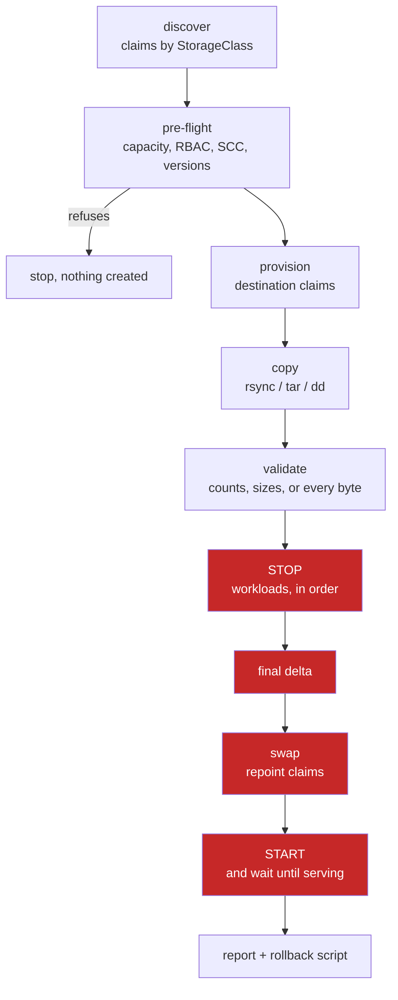

**The four highlighted stages are the cutover window.** Everything preceding them
executes with the application running, regardless of method. Every phase records its
own duration to a permanent trace, and reporting reads that record rather than
asserting an estimate.

**Source volumes are never deleted.** They are set to `Retain` before anything else
happens, so they persist beyond their claims. Leftover volumes are surfaced for
reclamation; nothing is removed without an explicit operator action.

---

## Supported and Validated Environments

Trident Port is validated against the following platforms:

- **RKE2**
- **Red Hat OpenShift**
- **K3s**
- **Upstream Kubernetes 1.29+** (1.29+ required for live sync's native sidecar support)

| | |
|---|---|
| Kubernetes | any distribution Trident supports · **1.29+** for live sync |
| NetApp Trident | 24+ · **26.06+** for qtree import in SnapMirror mode |
| Trident backend | at least one `TridentBackendConfig` bound, provisioning into the destination StorageClass |
| Credentials | a Kubernetes Secret holding the ONTAP credentials |
| Registry | private image — a `docker-registry` pull secret per namespace |
| Licence | a token bound to the cluster's `kube-system` namespace UID |

---

## Deployment Models

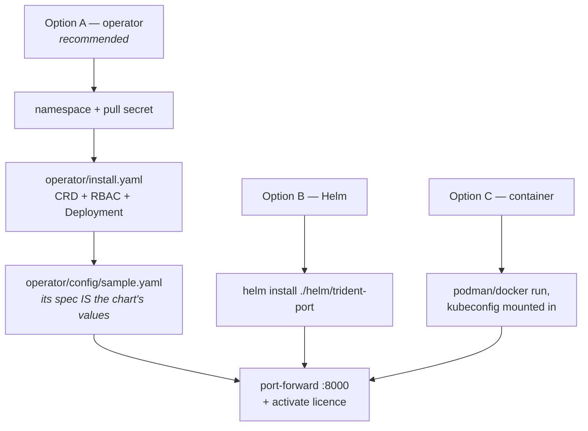

The chart's `appVersion`, defined in
[`helm/trident-port/Chart.yaml`](helm/trident-port/Chart.yaml), is what a deployment
runs. `tp --version` reports the version of an installed binary.

### Option A — Operator (Recommended)

[`operator/README.md`](operator/README.md) is the maintained deployment runbook,
including recovery from an interrupted adoption. **Deployment order is enforced: the
operator is always installed first** — the chart compares a content digest of the
RBAC it requires against the operator's live `ClusterRole`, and refuses a partial
upgrade on mismatch rather than proceeding halfway.

```bash
# 1. Operator namespace and registry credentials.
kubectl create namespace trident-port-system --save-config
kubectl -n trident-port-system create secret docker-registry ghcr \
  --docker-server=ghcr.io --docker-username=<user> --docker-password=<PAT>

# 2. Install the operator (CRD + RBAC + Deployment).
kubectl apply -f operator/install.yaml
kubectl -n trident-port-system rollout status deploy/trident-port-operator --timeout=300s

# 3. Product namespace and its own registry credentials — separate from the
#    operator's. The CR's spec is the chart's values file.
kubectl create namespace trident-port
kubectl -n trident-port create secret docker-registry ghcr \
  --docker-server=ghcr.io --docker-username=<user> --docker-password=<PAT>
kubectl apply -f operator/config/sample.yaml
kubectl -n trident-port rollout status deploy/trident-port --timeout=300s
```

The operator publishes the port-forward command and licence activation path in the
`Deployed` condition:

```bash
kubectl -n trident-port get tridentport trident-port \
  -o jsonpath='{.status.conditions[?(@.type=="Deployed")].message}'
```

### Option B — Helm

```bash
helm install trident-port ./helm/trident-port \
  --namespace trident-port --create-namespace \
  --set image.pullSecrets[0]=ghcr \
  --values my-values.yaml
```

`image.tag` is intentionally left empty — the chart installs its own `appVersion`,
keeping version and chart in lockstep. Values, RBAC and exposure:
[`docs/INSTALL.md`](docs/INSTALL.md).

### Option C — Standalone Container

The same image, run with a kubeconfig mounted in, as user `trident-port` (uid 1000) —
never as root. Steps in [`docs/INSTALL.md`](docs/INSTALL.md).

### Reaching the Interface

The default Service is `ClusterIP` by design: the API operates with the deployment's
own RBAC, so anything reaching it can stop workloads, repoint claims and delete
volumes through it. Helm and the standalone container each generate and persist an
access token — an `X-Trident-Port-Token` header, validated in constant time and
required on every request except health checks, static assets and the activation
screen. Expose the port only on a trusted network.

```bash
kubectl -n trident-port port-forward svc/trident-port 8000:8000
# http://localhost:8000 — the REST interface is self-documenting at /docs
```

### Licensing

A licence token, bound to the target cluster's `kube-system` namespace UID, is
required to migrate data. Contact NetApp or your account team to obtain one.

---

## Enterprise Packaging & Security

Trident Port ships as **a hardened, fully compiled artifact**, ensuring immutable
execution, a minimized attack surface, and no runtime dependency on host-level
scripts. The customer-facing image contains no interpretable source and no shell
tooling beyond what the running product itself requires — what is delivered is what
was built and validated.

**RBAC is namespace-agnostic, and scoped to exactly what each operation needs**
(`helm/trident-port/templates/rbac.yaml`, a single `ClusterRole`): read access on
core objects including `secrets` (get/list/watch, **never write** — this is how the
product reaches ONTAP credentials without requiring a copy per namespace),
create/delete on `batch/jobs` and `pods`, patch on
`deployments`/`statefulsets`/`daemonsets`/`replicasets`, and scoped access on each
supported operator's own CRD group — never a wildcard over custom resources.

**The copy workload is not a privileged container.** It runs as root
(`runAsUser: 0`) with `allowPrivilegeEscalation: false` and no additional
capabilities — sufficient to preserve filesystem ownership and write a raw block
device. Requesting `privileged` access is unnecessary and is rejected under
OpenShift's `restricted-v2` policy by design; the remediation the product surfaces is
`oc adm policy add-scc-to-user anyuid`. Exactly one code path requires an additional
capability: mounting a foreign NFS export, which requires `CAP_SYS_ADMIN`.

**Trident's own controller may be restarted as part of a SnapMirror import** — shared
CSI infrastructure, restarted by Trident itself, not by this product directly, when
an import is refused while a volume name is still held in memory. This occurs **at
most once per run, and only when an import was actually refused**; `--no-trident-restart`
disables this behavior, stopping the cutover at the first refused import with
remediation steps provided.

**Interface access is authenticated and scoped to a single deployment.** The default
Service is `ClusterIP`; the API runs with the deployment's own RBAC, so an
`X-Trident-Port-Token` header (generated and persisted at install time, validated in
constant time) is required on every request except health checks, static assets and
the activation screen.

**Licence entitlement is bound to the target cluster's identity** (its `kube-system`
namespace UID) and does not transfer if the token is copied to another cluster.
Completed migrations are recorded in a signed usage ledger (HMAC), protecting the
integrity of the usage count independent of the cluster operator.

**Every operation is auditable.** `/metrics` exposes Prometheus-format migration
counts, licence status and audit counters; `tracking/trace.jsonl` is an append-only,
SIEM-ready record of the CLI and web interface, including every refusal.

---

## Command Reference

**Licensing model**: read-only planning (`survey`, `plan`) and critical disaster
recovery operations (`rollback`, `stand-down`) are permanently unlocked and do not
require an active licence entitlement. Operations that migrate or mutate data require
a validated licence.

**Reading and planning — no licence required**

| Command | What it does |
|---|---|
| `tp survey` | assesses whether a cluster is eligible for migration; read-only, dry-runs a copy pod's admission |
| `tp plan` | reports what would happen to one namespace's claims, method by method |
| `tp space` | projects whether the source volume fills before a baseline completes; sampled over time |
| `tp validate` | compares source and destination; performs no writes |
| `tp sessions` | lists migrations on this installation, or follows one in progress |
| `tp report` | reports what happened to a namespace's volumes, matching the interface's view |
| `tp array-leftovers` | lists array volumes no longer referenced by the cluster; explains, does not delete |
| `tp pre-engagement` | produces the read-mostly assessment kit for a discovery engagement |
| `tp rollback` | restores reclaim policies, lists or removes leftovers |
| `tp start` | restores application availability after a stopped run |
| `tp support-bundle` | collects a complete diagnostic bundle |
| `tp stand-down` | scales this deployment to zero if a licence lapses |

**Data operations — licensed**

| Command | What it does |
|---|---|
| `tp auto` | migrates a whole namespace in one coordinated stop: discover, pre-flight, copy, validate, cut over, verify |
| `tp migrate` | migrates a single volume |
| `tp batch` | migrates several namespaces in sequence, each to its own destination |
| `tp snapshot` | copies from a clone while the application remains online (`bulk`), then cuts over (`cutover`) |
| `tp live-sync` | `start`, `status`, `stop`, `cutover` |
| `tp snapmirror` | replicates FlexVols between arrays and adopts their contents |
| `tp import` | brings a foreign NFS export into a Trident claim |
| `tp cutover` | repoints claims to the new volumes |
| `tp stop` | stops the workloads holding the claims |

### A Namespace, End to End

```bash
# Rehearsal: discovery and pre-flight only. Nothing is created, stopped or copied.
tp auto --namespace shop --dest-sc ontap-nas --dry-run

# Execute: one coordinated stop, every claim in the namespace.
tp auto --namespace shop --dest-sc ontap-nas

# Multiple source classes in one namespace: a destination per source class.
tp auto --namespace shop --dest-sc ontap-nas --sc-map "longhorn=ontap-nas,ceph-rbd=ontap-san"

# Copy and validate only, leaving applications in place.
tp auto --namespace shop --dest-sc ontap-nas --exclude cache-0 --no-cutover
```

**Four parameters govern the cutover window**, each defaulting to full concurrency
except adoption:

| Flag | Governs | Default |
|---|---|---|
| `--copy-parallel` | the copy — a Job, a pod and an image pull per volume | all |
| `--stop-parallel` | stopping workloads, within each ordering tier | all |
| `--start-parallel` | restoring workloads — already down, so higher concurrency introduces no additional risk | all |
| `--adopt-parallel` | `tridentctl import` concurrency | **1** |

`--bwlimit` caps the read rate in rsync's own notation (`20M`, `200K`) and is the
only throttling control.

### The Other Methods

```bash
# Snapshot: copy from a clone with the application online, then take the delta.
tp snapshot bulk    --namespace shop --pvc data-0 data-1 --dest-sc ontap-nas
tp snapshot cutover --namespace shop --pvc data-0 data-1

# Live sync: a sidecar keeps the destination current; the cut is the final delta.
tp live-sync start   --namespace shop --pvc data-0 --dest-sc ontap-nas
tp live-sync cutover --namespace shop --pvc data-0 --dest-sc ontap-nas

# SnapMirror, ONTAP to ONTAP. Plan first; the baseline runs with the application online.
tp snapmirror --namespaces shop --dest-svm svm_new --plan-only
tp snapmirror --namespaces shop --dest-svm svm_new --cutover-only

# Adopt an existing NFS export. The source is mounted read-only.
tp import --namespace shop --server 10.0.0.5 --path /exports/archive \
  --claim archive --dest-sc ontap-nas --size 500Gi
```

### Validation and Rollback

`tp validate` compares counts, sizes and effective modification times by default;
`--mode full` (or `strict`) reads every byte on both sides. **Raw block volumes are
always compared across the full device** — a matching prefix is the absence of
counter-evidence, not confirmation of a match. Excluded by design: a formatted block
destination's `lost+found`, and Trident's own `.snapshot`/`trident_pvc_*` paths.

Every run leaves a session under `tracking/sessions/<id>` with its plan, its
per-phase log and a rollback script.

```bash
tp sessions
tp sessions --session sess-8a21 --follow
tp rollback --namespace shop                                    # restores reclaim policies, lists leftovers
tp rollback --namespace shop --to-source --session sess-8a21 --yes
```

**`--to-source` is a reverse migration, not an undo.** It repoints the application to
its original volume; data written to the destination since cutover remains there.
This is stated explicitly before the operation executes.

---

## The Web Interface

|  |  |
|---|---|
| 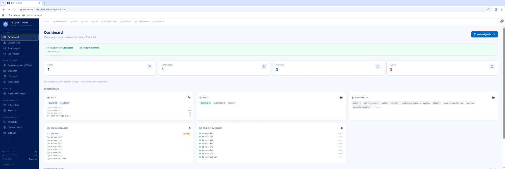 | 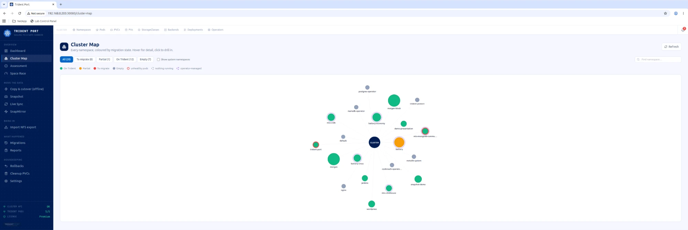 |
| 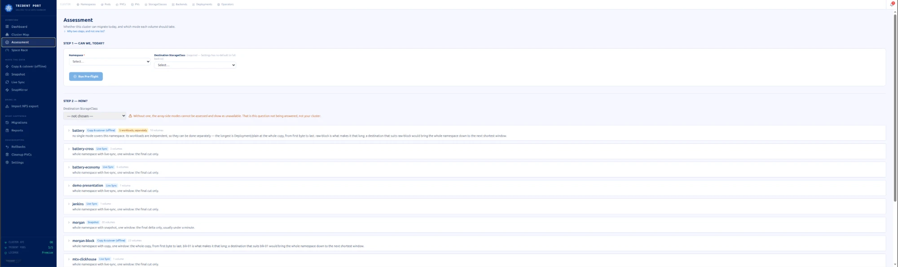 | 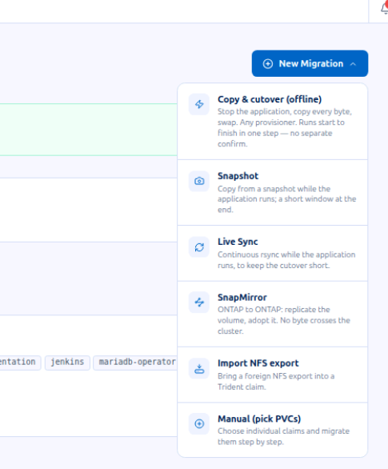 |
| 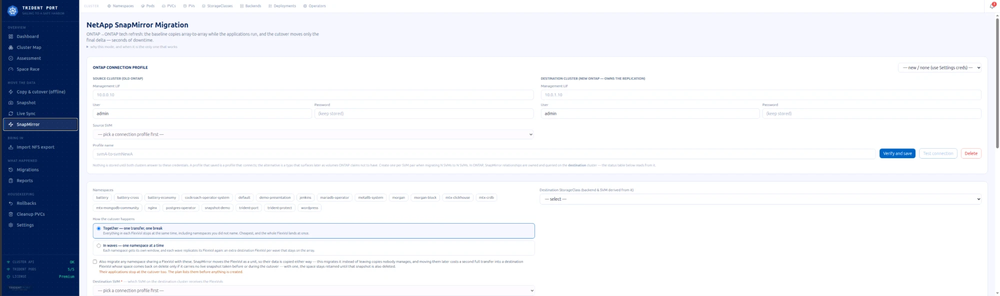 | 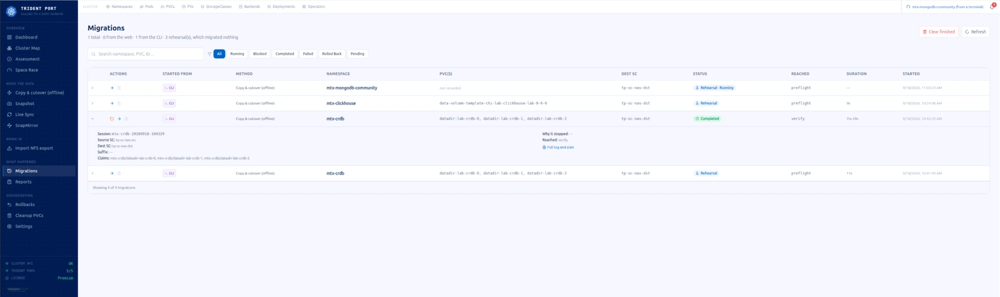 |
| 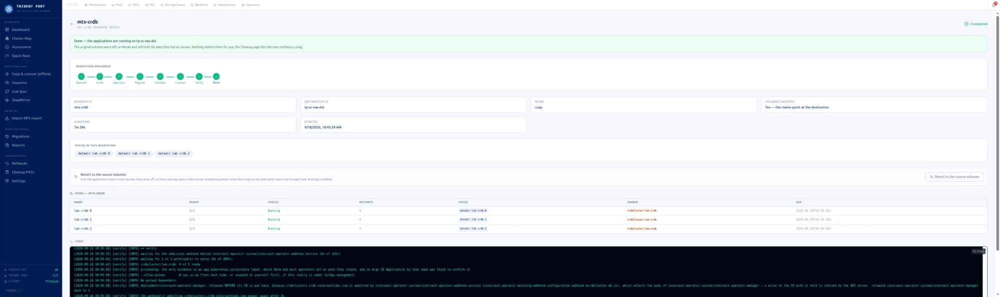 | 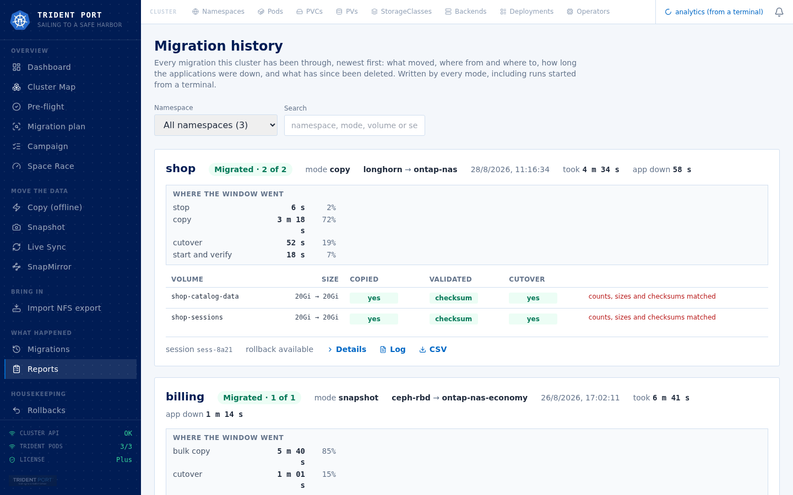 |
| 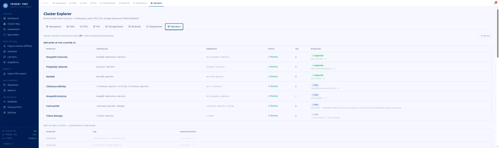 | 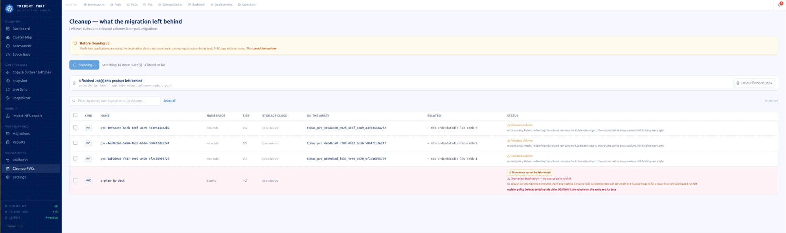 |
| 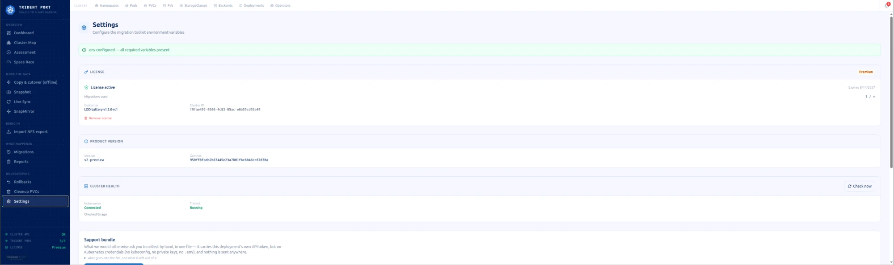 | |

| Page | Path | Purpose |
|---|---|---|
| Dashboard | `/dashboard` | cluster overview, claim counts, configuration state |
| Assessment | `/assessment` | pre-flight and the migration plan, on one screen |
| Cluster Map | `/cluster-map` | every namespace as a node, coloured by state, with operator overlay |
| New Migration | `/migrations/new` | the guided migration wizard |
| Auto Migration | `/auto-migration` | a whole namespace in one launch |
| Batch Migration | `/batch-migration` | multiple namespaces, sequential or parallel against a live capacity ceiling |
| Space Race | `/space` | projects whether the source will fill before the baseline completes |
| Cutover | `/cutover` | the swap, as an isolated operation |
| Snapshot · Live Sync · SnapMirror | `/snapshot-migration` `/live-sync` `/snapmirror` | one page per method |
| Import NFS | `/import-nfs` | adopt an external export |
| Sessions | `/sessions` | every run, live or finished |
| Migrations · Reports | `/history` `/reports` | migration history, one row per volume |
| Rollbacks | `/rollbacks` | the undo path, per session |
| Cluster Explorer | `/cluster` | namespaces, pods, claims, volumes, StorageClasses, backends |
| Cleanup | `/cleanup` | source claims and orphaned Released volumes |
| Settings | `/settings` | configuration, connection testing, permissions, licence |

---

## Applications With an Operator

A StatefulSet owned by an operator must be stopped **through its Custom Resource**,
or the operator restores it automatically — measured at under one second. Detection
is by `ownerReferences` and CR name; the registry covers **40 kinds** (PostgreSQL,
MongoDB, MySQL/MariaDB, Kafka, Elasticsearch, OpenSearch, Redis, Valkey, Cassandra,
ScyllaDB, CockroachDB, TiDB, ClickHouse, Couchbase, MinIO, etcd, RabbitMQ,
Prometheus and others).

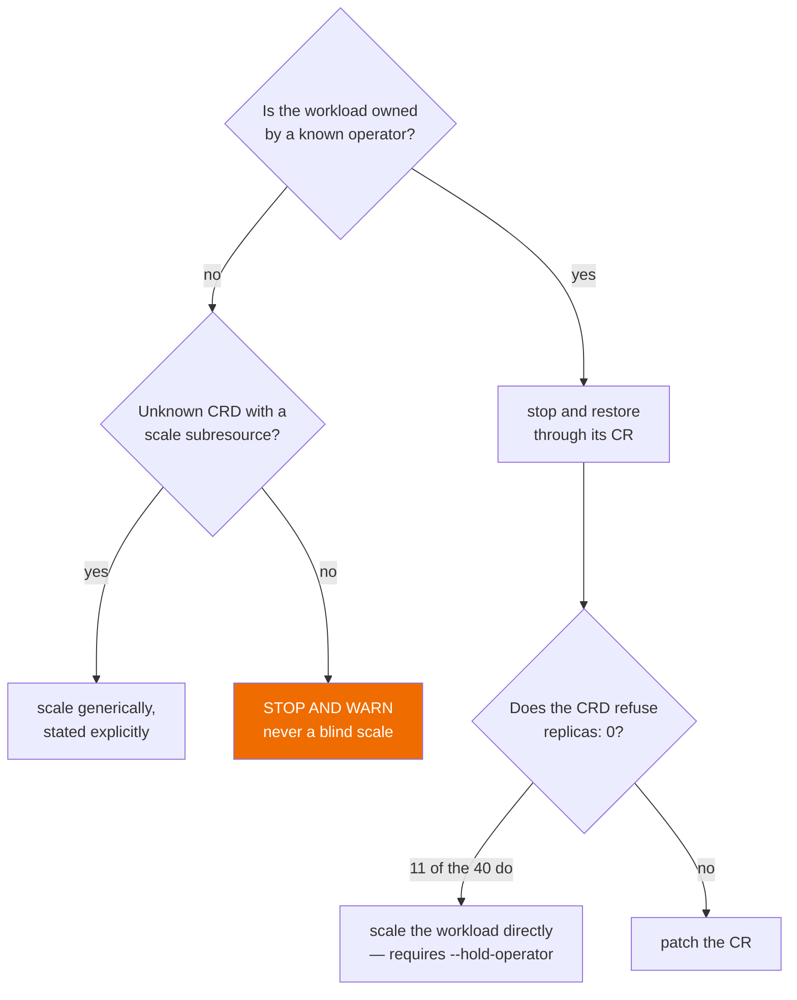

**The replica count is read and recorded before any scale-down occurs**, in order: an
annotation from a prior run, then the CR's own spec, then a default of 1. The
annotation takes precedence because an interrupted run can leave the spec itself at
zero, and restoring that value would report success against a namespace that never
returns to service.

An operator serving *other* namespaces is never suspended without explicit
authorization: `--hold-operator` is an operator-level acknowledgment that nothing
reconciles there for the duration of the window.

### The Four Cutover Mechanisms for Operator-Managed Workloads

1. **Native pause, by CR** — a dedicated pause field (`spec.offline`, `spec.stop`).
2. **Operator hold** — the operator's Deployment to 0, StatefulSet scaled directly.
3. **Zero, by CR** — patches the CR's own replica field; the operator scales itself down.
4. **Orphan + PV Retain** — deletes the owner, with the PV already set to `Retain`.
   Available today for KubeVirt.

### Validated Compatibility, by Operator Kind

Every migration path is measured end to end against a real cluster before it is
published as supported. `✅` denotes a validated, production-ready path; `WIP`
denotes active engineering work; `excluded` marks a deliberate scope decision.

Each entry lists the mechanism applied (1–4 above, or `generic` for kinds without a
dedicated CRD path) alongside its validation status.

| Kind | Mechanism · Status | Kind | Mechanism · Status |
|---|---|---|---|
| `Airflow` | generic · WIP | `Alertmanager` | 3 · WIP |
| `ArangoDB` | generic · WIP | `Artifactory` | generic · ✅ |
| `CassandraDatacenter` | 2 · ✅ | `CephCluster` (Rook) | excluded |
| `ClickHouseInstallation` | 1 · WIP | `Cluster` (CloudNativePG) | 1 · WIP |
| `CouchDB` | generic · ✅ | `CouchbaseCluster` | 2 · WIP |
| `CrdbCluster` (CockroachDB) | 2 · ✅ | `Dragonfly` | 3 · ✅ |
| `Elasticsearch` | 3 · WIP | `EtcdCluster` | 3 · WIP |
| `Gitea` | generic · ✅ | `Harbor` | generic · ✅ |
| `Hazelcast` | 3 · WIP | `InfluxDB` | generic · WIP |
| `InnoDBCluster` (Oracle) | 2 · WIP | `Jenkins` | generic · WIP |
| `KafkaNodePool` | 2/3 · WIP | `Keycloak` | 3 · WIP |
| `MariaDB` | 3 · ✅ | `Memcached` | — · WIP (chart has no volume) |
| `Milvus` | 3 · ✅ | `MongoDBCommunity` | 3 · WIP |
| `MySQLCluster` (MOCO) | 1 · ✅ | `MysqlCluster` (Presslabs) | 3 · ✅ |
| `NATS` | generic · ✅ | `Neo4j` | generic · ✅ |
| `OpenSearchCluster` | 3 · WIP | `PerconaServerMongoDB` | 3 · ✅ |
| `PerconaXtraDBCluster` | 3 · ✅ | `Prometheus` | 3 · WIP |
| `Pulsar` | generic · WIP | `RabbitmqCluster` | 3 · ✅ |
| `RedisCluster` | 3 · WIP | `RedisEnterpriseCluster` | 3 · WIP |
| `RedisFailover` | 3 · WIP | `ScyllaCluster` | 3 · WIP |
| `Seaweed` | 2 · ✅ | `SolrCloud` | 3/2 · WIP |
| `TemporalCluster` | 2 · ✅ | `Tenant` (MinIO) | 3 · WIP |
| `TidbCluster` | 3 · WIP | `Valkey` | 3 · WIP |
| `Vault` | excluded | `VirtualMachine` (KubeVirt) | 4 · ✅ |
| `VMCluster` | 1 · ✅ | `ZookeeperCluster` | 2 · WIP |
| `postgresql` (Zalando) | 3 · ✅ | | |

**21 validated, production-ready paths**, each measured clean end to end against a
real cluster. `KafkaNodePool` and `SolrCloud` list two mechanisms because neither
alone stops them fully — both have been evaluated, and both remain active work.
Kinds requiring a third-party licensed operator to validate (MongoDB Enterprise,
CrunchyData PostgreSQL Operator, Sonatype Nexus Repository via Red Hat Connect) are
tracked separately and engaged on a per-opportunity basis.

`VirtualMachine`'s disk migrates through its own dedicated DataVolume swap
(`tp compat kv-dv-swap.sh swap <ns> <vm> <datavolume> <target-pv> <target-sc>`),
mechanism 4's shape rather than a CR patch — validated end to end, including data
integrity inside the guest. `MySQLCluster` (MOCO) is the validated case of mechanism 1
working exactly as designed: a dedicated `spec.offline` field, not a replica count.
`Gitea`, `CouchDB`, `Neo4j`, `ArangoDB`, `InfluxDB`, `Harbor`, `Pulsar`, `Artifactory`,
`Jenkins` and `Airflow` are validated through the generic unknown-operator path
(direct, stated scaling); `CouchDB`, `NATS`, `Gitea` and `Neo4j` are confirmed there
today. `CephCluster` (Rook) is excluded by design: storage infrastructure, like
Trident itself, is not a migration target for this product. `Vault` is excluded by
design as well: migrating its Raft store underneath it is a correctness risk outside
the product's scope — validated against real hardware, the storage transfer itself
completes cleanly, but Vault's own seal state requires its native unseal procedure
regardless, so a clean storage copy alone does not constitute a working handoff.
`Milvus` (mechanism 3 entry) follows the same pattern as `TemporalCluster`: its own CR
patch is not exercised in practice because state resides in dependent services (etcd,
MinIO) rather than the patched component — the namespace migration itself, through
those dependencies' volumes, completes cleanly end to end. `Memcached`'s current chart
ships with no persistent volume — nothing to migrate, pending a chart revision.

---

## Operational Safeguards

- **Infrastructure namespaces** are protected by default; `--i-know-this-is-infrastructure`
  is required to proceed — stopping workloads in a namespace running storage
  infrastructure removes volumes rather than quiescing them.
- **A namespace under active GitOps reconciliation (Argo CD or Flux)** is detected and
  the operation is declined, naming the owning resource and the exact suspend
  command. `--allow-gitops` is the documented override, with both associated risks
  stated explicitly.
- **A second run against a namespace already in flight is refused, not queued.**
  `tp auto`, `tp batch`, `tp snapmirror` and `tp live-sync` all route through a single
  session guard:

  ```
  [ERROR] a migration of 'shop' is already running: shop-20260911-101500
    (started …, phase 'copy'). Two concurrent runs on one namespace would
    read volumes the first run is actively restoring.
  ```

- **A dry run creates, stops or copies nothing** — enforced at the engine level.
- **A long-running copy is never silent.** Progress is reported on a fixed interval,
  with elapsed time and the exact command to follow the live log.

---

## What Survives a Cutover

**Label and annotation retention follows a deny-list, not an allow-list**
(`tp_core/pvcmeta.py`). Every label on the source claim carries to the replacement
unfiltered — there is no maintained list of "supported" annotations to extend as
tooling evolves. `backup.velero.io/backup-volumes`, `argocd.argoproj.io/tracking-id`,
`cdi.kubevirt.io/storage.populatedFor`, cost-centre labels: all are preserved.

**Three annotation families are dropped, each for a stated reason** — properties true
of the binding being replaced, and false of its replacement:

| Dropped | Rationale |
|---|---|
| `pv.kubernetes.io/*`, `volume.kubernetes.io/*`, `volume.beta.kubernetes.io/*` | written by the binding machinery; the API server writes its own on the new claim |
| `trident.netapp.io/*` | Trident's record of a prior SnapMirror import — true of the volume just imported onto, false of the one it is migrating to |
| `kubectl.kubernetes.io/last-applied-configuration` | describes the object as declared before the migration; a later `kubectl apply` would diff against a spec that no longer exists |

Every deliberately dropped annotation is named in the migration report, distinguishing
an intentional design decision from data loss.

---

## Observability

- **`/metrics`** — Prometheus text exposition: migration counts by status, licence
  validity, tier and limit, verified ledger entries, audit counters.
- **`tracking/trace.jsonl`** — append-only JSON lines, a unified record for the CLI
  and the web interface, including every refusal. Suitable for SIEM ingestion.
- **`tracking/sessions/<id>/`** — the plan, per-phase logs and trace for every run;
  the basis of a support bundle.

---

## Troubleshooting and Expected Results

| Situation | Observed Behavior | Resolution |
|---|---|---|
| A second run against a namespace already migrating | Refused: a migration of that namespace is already in progress | By design — concurrent runs on one namespace would overwrite each other's copy in progress. Wait for completion, or follow the active session |
| `tp auto` against an infrastructure namespace | Declined by default, requiring `--i-know-this-is-infrastructure` | Stopping workloads where storage itself runs can remove volumes rather than quiesce them. Requires explicit acknowledgment |
| A namespace under active Argo CD/Flux reconciliation | Declined, naming the owning resource and the exact suspend command | `--allow-gitops` is the documented override, with both associated risks stated |
| `--dry-run` performs no changes | Enforced at the engine level | Any state change during a rehearsal is treated as a defect |
| A long-running copy shows no progress percentage | A status line is emitted on a fixed interval, with elapsed time and the exact command to follow the live log | rsync-based transfers cannot produce a reliable ETA; progress is reported by interval instead |
| OpenShift rejects the copy pod | Pod unschedulable under `restricted-v2` | Do not request `privileged` — the remediation the product prints is `oc adm policy add-scc-to-user anyuid` |
| A generic Kubernetes namespace under `PodSecurity: restricted` rejects the copy pod | Same failure class as the OpenShift case, on a different platform | The product prints the exact remediation: `kubectl label ns <ns> pod-security.kubernetes.io/enforce=baseline --overwrite` |
| `Forbidden` on a newly onboarded operator's CRD | That operator is not yet declared in the product's `ClusterRole` | RBAC is granted per operator, by explicit rule — never a wildcard. A new operator kind requires that rule before this product can manage it |

**A successful migration** is confirmed when `tp validate` agrees with the
byte-level checksum comparison, the migration report shows all cutover phases
with measured durations, and a complete session record exists under
`tracking/sessions/<id>/`, including its plan, per-phase log and rollback script.

---

## Support

- **`tp support-bundle`** produces a complete diagnostic archive (logs, trace,
  session state) for submission to support.
- Before contacting support, capture the active session (`tp sessions --session
  <id> --follow`) and the exact error text — the majority of conditions in the
  table above are self-resolving with that information alone.
- Contact your NetApp account team or supporting partner for engagement-specific
  support channels.

---

## Prerequisites and Best Practices

Beyond the environment requirements above, the following should be confirmed
ahead of a migration window rather than discovered during one:

- **RBAC, and on OpenShift the appropriate SCC exception, applied in advance** —
  on OpenShift, `oc adm policy add-scc-to-user anyuid` (never request
  `privileged`: rejected under `restricted-v2` by design); on a generic cluster
  enforcing `PodSecurity: restricted`, the `baseline` label the product itself
  documents.
- **A `VolumeSnapshotClass` registered with a driver matching the source
  provisioner**, when the snapshot method is intended — the planning engine will
  otherwise exclude it, but resolving this ahead of time avoids a mid-window
  surprise.
- **The destination `TridentBackendConfig` already in `Bound` state** before a
  run begins.
- **ONTAP credentials provisioned as a reachable Kubernetes Secret.**
- **A registry pull secret present in every target namespace.**

---

## Performance and Sizing

**Figures below are measured, not projected, and scoped to the environment in
which they were captured.** From validation against a vSphere CSI → Trident
environment, one representative dataset:

| Mode | Measured Cutover Window | Scales With Dataset Size |
|---|---|---|
| Offline copy | 155 s | Yes — the entire transfer occurs inside the window |
| Snapshot | 65 s | No, predominantly fixed cost — only the final delta is inside the window |
| Swap, per volume | 6 s floor | No — a pointer repoint, not a data transfer |

- **Offline copy places the entire transfer inside the cutover window** — window
  duration scales with dataset size.
- **Snapshot and live-sync remove the bulk transfer from the cutover window** —
  the window is dominated by the final delta, largely independent of total
  volume size.
- **SnapMirror cuts by FlexVol, not by individual claim** — on economy storage
  classes, namespaces sharing a FlexVol are cut together in a single array
  operation (see FlexVol-sharing behavior under [The Four Methods](#the-four-methods)).

For sizing guidance specific to a customer's dataset and topology, engage your
NetApp account team for a scoped assessment.

---

## Documentation

| | |
|---|---|
| [`documentation/`](documentation/README.md) | the manual: overview, installation, methods, operations, rehearsal and engagement procedure |
| [`docs/INSTALL.md`](docs/INSTALL.md) | Helm installation, values, licence activation, standalone container |
| [`operator/README.md`](operator/README.md) | the operator deployment path |
| [`documentation/07-precheck-runbook.md`](documentation/07-precheck-runbook.md) | pre-window checks, including OpenShift SCC and RBAC requirements |
| [`pre-engagement/`](pre-engagement/README.md) | the read-only assessment kit, designed to run before any installation |

---

## Licence

Trident Port is commercial software.
Copyright © 2026 Carlos Alzaga. All rights reserved.

Licensing: [github.com/CalzDevOps](https://github.com/CalzDevOps)

---

*Trident Port — Sailing to a Safe Harbor*
